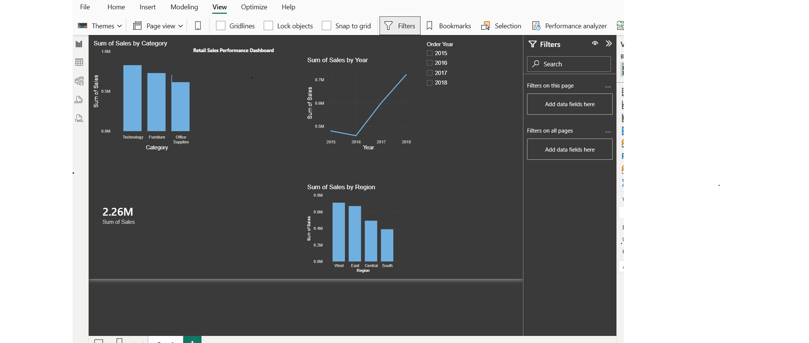

# Retail Sales Performance Dashboard

End-to-end retail analytics project: cleaned and analyzed 4 years of transaction data (9,800+ records) using Python and SQL, then built an interactive Power BI dashboard with dynamic filtering.

## Dashboard

## Tools Used
- **Python** (Pandas, NumPy) — data cleaning and transformation
- **SQL** (SQLite) — revenue trend, YoY growth, and regional performance analysis
- **Power BI** — interactive dashboard with KPI cards, drill-down visuals, and year slicer
- **Excel (openpyxl)** — automated, formula-driven report generator

## Key Insights
- Total revenue: **$2.26M** across 2015–2018
- **Technology** was the top revenue-driving category (36.6%), followed by Furniture (32.2%) and Office Supplies (31.2%)
- 2017 saw the strongest YoY growth at **+30.6%**, after a slight dip (-4.3%) in 2016
- **West region** was the top performer ($710K); **South region** underperformed at $389K, highlighting a target area for growth

## Files in this Repository
| File | Description |
|---|---|
| `superstore_cleaned.csv` | Cleaned dataset ready for analysis |
| `01_clean_data.py` | Python script for data cleaning and transformation |
| `02_analysis_queries.sql` | SQL queries for revenue trends, YoY growth, and regional analysis |
| `03_generate_report.py` | Automation script that generates a formula-driven Excel report with charts |
| `Retail_Sales_Report.xlsx` | Auto-generated Excel report (output of the automation script) |
| `dashboard.png` | Screenshot of the Power BI dashboard |

## Dataset
Based on the Sample Superstore dataset (2015–2018, 9,800 transactions across 4 US regions).
